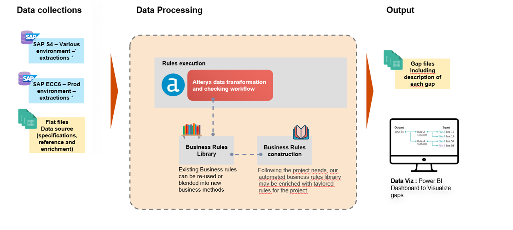

# SAP ECC to SAP S/4 Post-Migration Data Validation Tool

## 📌 Overview
This project provides an automated solution to validate data consistency between **SAP ECC** and **SAP S/4HANA** systems after migration.  

The solution is built with **Alteryx** (as a reusable macro) and visualized through a **Power BI** dashboard. It automates the traditionally manual validation process, reducing effort and improving accuracy.

---

## ⚙️ How It Works
The Alteryx macro performs the following steps:
1. **Inputs**
   - **ECC Input** → Extracted dataset from SAP ECC.
   - **S/4 Input** → Extracted dataset from SAP S/4HANA.
   - **Mapping File** → Defines mapping between ECC field names and their corresponding S/4 field names.

2. **Processing**
   - Applies field mapping (to resolve naming differences).
   - Performs transformations (transpose, formulas, and data alignment).
   - Validates data **for each key** between ECC and S/4.
   

3. **Outputs**
   - **KO Fields ECC** → Fields present in ECC but not matching in S/4.
   - **KO Fields S/4** → Fields present in S/4 but not matching in ECC.
   - **KO Rows ECC** → Rows present in ECC but missing in S/4.
   - **KO Rows S/4** → Rows present in S/4 but missing in ECC.

4. **Visualization**
   - A **Power BI report** provides clear insights for business users.
   - Highlights mismatches, missing records, and validation results.
     **I could not share the PBI report for privacy concerns**

---

## 🚀 Key Benefits
- ⏱ **Time Savings**:  
  Reduced manual validation effort from **~3 hours per object** to **5–10 minutes** (execution time).

- 🔁 **Reusability**:  
  The macro is reusable for **any SAP object** (no need to build separate templates).

- ✅ **Improved Accuracy**:  
  Eliminates human error common in manual validation using Excel templates.

- 📊 **Business Insights**:  
  Interactive Power BI dashboard for SAP consultants and business users.

---

## 📂 Project Components
- **Alteryx Macro**: Handles data preparation, mapping, and validation logic.
- **Power BI Report**: Presents results in a user-friendly, interactive manner.
- **Mapping File (CSV/Excel)**: Defines ECC–S/4 field name relationships.
  

---

## 🛠️ Technologies Used
- **Alteryx Designer** – Data preparation, transformations, and validation macro.
- **Power BI** – Visualization and reporting.
- **SAP ECC & SAP S/4 Extracts** – Source and target data for validation.

---

## 📈 Impact
This tool has streamlined SAP post-migration validation by:
- Saving **hundreds of consulting hours** across large-scale migrations.
- Providing a **repeatable framework** for data quality checks.
- Delivering **greater trust and confidence** in SAP migration outcomes.
- Delivering **a reusable asset** for the business users for next migration waves without the data team intervention.

---

